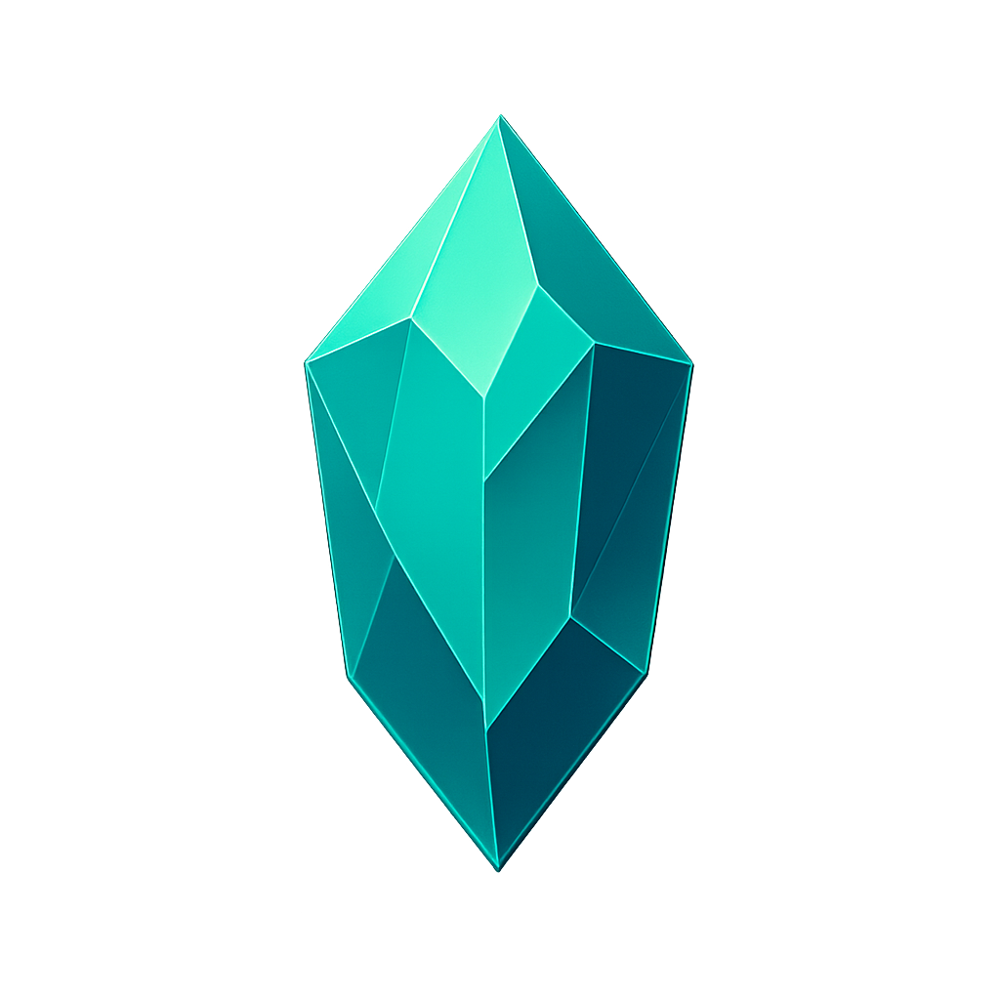

# CrystalBudget iOS



**CrystalBudget** is a native iOS budget management application built with React, TypeScript, and Capacitor. Features offline-first architecture with local data storage, native iOS UI, haptic feedback, and push notifications.

## Key Features

- **Offline-First**: All data stored locally, works without internet
- **Native iOS Experience**: iOS-native UI, haptic feedback, push notifications
- **Expense Tracking**: Create, edit, delete transactions instantly
- **Income Management**: Track multiple income sources
- **Category Management**: Custom categories with budgets
- **Receipt Scanning**: Camera integration for receipt photos
- **Reports & Analytics**: Visualize your finances with charts
- **Haptic Feedback**: Tactile feedback for all interactions
- **Safe Area Support**: Works with iPhone notch and Dynamic Island

## Tech Stack

- **Frontend**: React 18, TypeScript, Vite
- **Mobile**: Capacitor 7 (iOS only)
- **UI**: Radix UI, iOS-native styles
- **Storage**: Capacitor Preferences (offline-first)
- **Platform**: iOS only

## Getting Started

### Prerequisites

- macOS with Xcode
- Node.js v20+
- iOS device or simulator

### Installation

1. Clone the repository:
   ```bash
   git clone https://github.com/yourusername/crystalbudget-ios.git
   cd crystalbudget-ios
   ```

2. Install dependencies:
   ```bash
   npm install
   ```

3. Build and open in Xcode:
   ```bash
   npm run ios:build
   ```

4. In Xcode:
   - Select your iPhone as target
   - Build and run (Cmd+R)

## iOS Scripts

- `npm run build` - Build the web app
- `npm run ios:sync` - Sync with iOS project
- `npm run ios:open` - Open in Xcode
- `npm run ios:run` - Run on simulator
- `npm run ios:build` - Build and open in Xcode

## Offline-First Architecture

All data is stored locally on the device:
- ✅ Transactions
- ✅ Categories
- ✅ Incomes
- ✅ Income sources

**No internet connection required for core functionality!**

## Installation Methods

### Development (Free)
1. Open in Xcode: `npm run ios:open`
2. Select your iPhone as target
3. Build and run (Cmd+R)
4. App expires in 7 days

### Production
1. Apple Developer Account ($99/year)
2. Archive in Xcode
3. Upload to App Store Connect
4. Submit for review

## Documentation

- [iOS Setup Guide](iOS-SETUP.md)
- [iOS Features](iOS-FEATURES.md)
- [Offline-First Architecture](OFFLINE-FIRST.md)
- [Quick Start](iOS-QUICK-START.md)

## Features in Detail

### Native iOS UI
- SF Pro font family
- iOS-native shadows and blur effects
- Safe Area insets support
- Native transitions and animations

### Haptic Feedback
- Light tap for selections
- Medium impact for actions
- Heavy impact for confirmations
- Notification haptics for alerts

### Push Notifications
- Local notifications
- Badge count updates
- Notification actions
- Background processing

### Camera Integration
- Receipt scanning
- Photo picker
- Base64 encoding
- Permission handling

## Contributing

We welcome contributions! Please fork the repo and submit a pull request.

1. Fork the Project
2. Create your Feature Branch (`git checkout -b feature/AmazingFeature`)
3. Commit your Changes (`git commit -m 'Add some AmazingFeature'`)
4. Push to the Branch (`git push origin feature/AmazingFeature`)
5. Open a Pull Request

## License

Distributed under the MIT License. See `LICENSE` for more information.

## Contact

Project Link: [https://github.com/yourusername/crystalbudget-ios](https://github.com/yourusername/crystalbudget-ios)

---

*Built with ❤️ for iOS users who want fast, offline budget management*